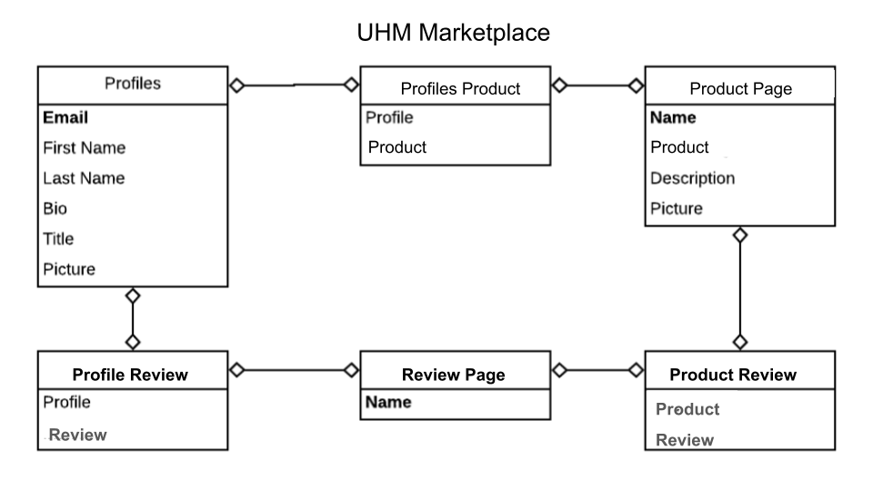
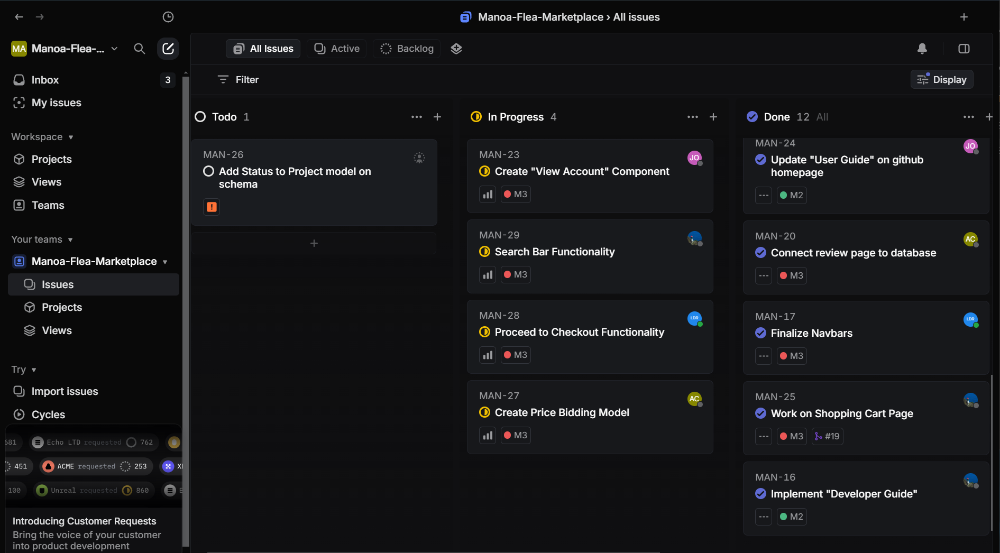
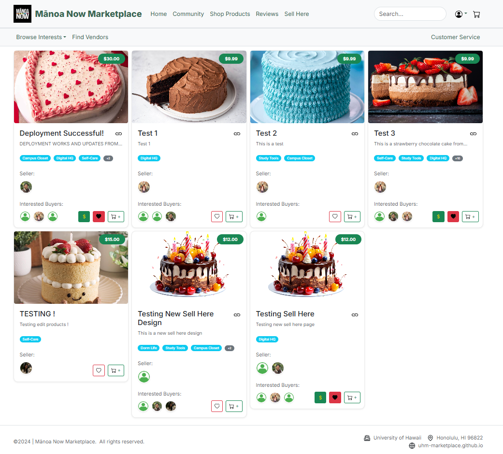
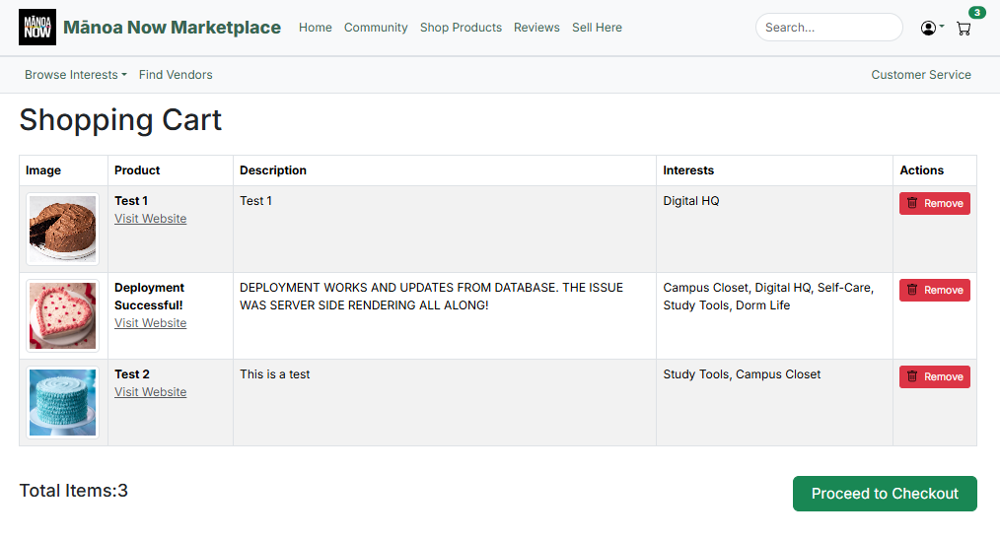
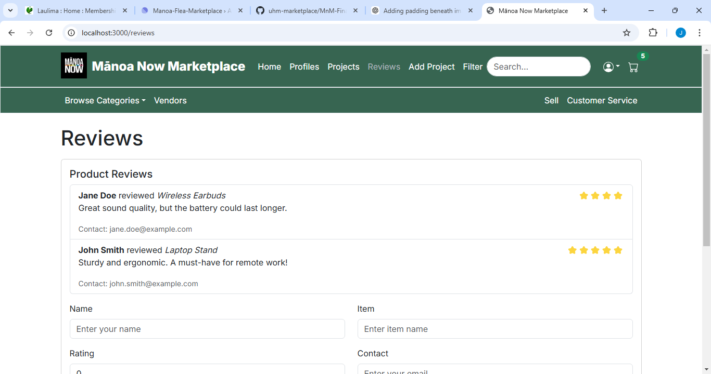

# Welcome to UHM Marketplace
[](https://github.com/uhm-marketplace/MnM-Final/actions/workflows/ci.yml)

## Table of contents
* [About UHM Marketplace](#about-uhm-marketplace)
* [Key Features](#key-features)
* [User Guide](#user-guide)
* [Getting Started](#get-started)
* [Support](#support)
* [Stay Connected](#stay-connected)

## Team Contract
[UHM Marketplace Project Team Contract](https://docs.google.com/document/d/1OrdN7T1u43kKi0lD1YMrSia3feM4pP5XNusmPdG4JrQ/edit?usp=sharing)

## Deployment
[View UHM Marketplace](https://m-n-m-final.vercel.app/)

## ER Diagram


## Project Pages

We decided to use [Linear](https://linear.app/features) for issue management instead of the GitHub template.

[M1 Project Page](https://linear.app/manoa-flea-marketplace/team/MAN/all)


[M2 Project Page](https://linear.app/manoa-flea-marketplace/team/MAN/label/m2)


[M3 Project Page](https://linear.app/manoa-flea-marketplace/team/MAN/all)


[Playwright-Test](https://courses.ics.hawaii.edu/ics314f24/morea/testing/experience-testing-nat.html)

## About UHM Marketplace

UHM Marketplace is a comprehensive platform for University of Hawai‘i students and staff to buy, sell, and trade a wide variety of items, from electronics and textbooks to collectibles and accessories. Modeled after popular platforms like Amazon and eBay, UH Marketplace aims to provide users with a seamless and secure shopping experience tailored to the university community.

UHM Marketplace displays various different technologies useful for Software Engineering students such as:
* **Next.js** for server-side rendering and static site generation, enhancing load times and SEO.
* **React** for component-based UI development and efficient, interactive client-side rendering.
* **Bootstrap 5** for a clean, accessible, and responsive design, offering utility classes and pre-styled components that enhance user experience across all devices.

This platform also demonstrates useful design principles and functionalities:

* **Collections for Items, Users, and Transactions**, along with "join" collections to track interactions and ensure data consistency.
* **Filter and Sort Options** for users to navigate large inventories and find items efficiently.
* **Secure Data Management and Validation** on both client and server sides, ensuring a trusted environment.
* **Accessibility and Responsive Design** to provide a positive experience across different devices and user needs.

Through these features and technologies, UH Marketplace aims to become an essential platform for buying, selling, and trading within the UH community.

---

## Key Features

- **Product Listings**: Browse through a vast collection of items listed by sellers.



- **User Profiles**: Create a profile to manage your listings, purchases, and reviews. <br>
*Users will create a profile using their University of Hawaii email (ending in @hawaii.edu) in order to secure the community that will be using the marketplace. Users must sign in before they are able to purchase, sell, or make any kind of transaction.*


- **My Cart/Purchases**: Users will be able to click on their carts and see what they added and can proceed to make a transaction after reviewing their items.

  
- **Reviews and Ratings**: Leave feedback for sellers and buyers to build trust within the community.



---

## User Guide

1. **Getting Started**
- Sign Up
- Click on the Sign Up button in the top-right corner of the homepage.
- Provide your email, create a password, and complete the required information.
- Verify your account via the confirmation email sent to you.
- Once signed in, you can access additional features like creating listings, managing your profile, and viewing transaction history.
- Log In
  - *Already have an account?* Use the Sign In option from the same menu to access your account.
  - *Forgot your password?* Use the "Forgot Password" link to reset it.

2. **Browse Items**:
- Search Bar
  - Use the search bar at the top of the page to quickly find items by name, category, or keywords.
  - Suggestions may appear as you type for faster navigation.
- Categories
  - Explore items by categories like Digital HQ, Dorm Life, Self-Care, and more.
  - Categories are accessible through the dropdown menu in the navbar or from the homepage.
- Filters
  - Narrow your search using filters:
  - Price Range: Set a minimum and maximum price.
  - Popularity: Sort by ratings or number of reviews.

3. **Make Transactions**:
- *For Buyers:*
  - Add Items to Cart:
    - Click the "Add to Cart" button on the item page.
    - View your cart to adjust quantities or remove items.
  - Checkout:
    - Proceed to checkout and review your items.
    - Enter your shipping and payment details.
    - Confirm your order to complete the purchase.
  - Order Tracking:
    - Check the status of your order in your Account Dashboard under the Orders section. <br>

- *For Sellers:*
  - List Your Items:
  - Go to the Sell section in the navbar.
  - Fill out the listing form with the following details:
    - Title: Name of the item.
    - Category: Select the appropriate category.
    - Price: Set a reasonable price.
    - Condition: Choose from New, Like New, or Used.
    - Description: Add a detailed description, including dimensions, features, and any issues.
    - Images: Upload clear photos of the item.
  - Manage Listings:
    - View and edit your listings under your Account Dashboard in the My Listings section.
    - Mark items as sold or update details when needed.
  - Handle Transactions:
    - Respond promptly to buyer inquiries.
    - Ship items quickly if required, or coordinate local pickup.

4. **Leave Feedback**:
- Write a Review
  - Go to the Reviews section after completing a transaction.
  - Provide a rating (1–5 stars) and leave a detailed review about the product and/or the seller.
  - Be honest and constructive in your feedback.
- Read Reviews
  - Check reviews on product pages to learn about other users' experiences before buying.
  - Use reviews to guide your purchasing decisions.

---

## Community Feedback

We invited five community members to test UHM Marketplace and collected their insights. Below are their thoughts, which helped us understand the user experience and identify areas for improvement.

### 1. Alex (Student - Regular Online Shopper)
**Feedback:**
- "The design feels intuitive, and I love how responsive it is on my phone. However, the product filtering could be more detailed, like adding subcategories."
**Suggestions:**
- Add more filtering options such as by condition (new/used) or seller rating.
**Experience:**
- Positive overall; Alex appreciated the quick loading times and clean layout.

### 2. Jamie (Faculty - New to Online Marketplaces)
**Feedback:**
- "The sign-up process was smooth, but I was a bit confused about how to list an item for sale initially. A tutorial would be helpful."
**Suggestions:**
- Include a step-by-step guide or onboarding video for new sellers.
**Experience:**
- Found the platform user-friendly after spending a few minutes exploring.

### 3. Sam (Alumni - Tech Enthusiast)
**Feedback:**
- "I really liked the use of UH email for sign-up; it makes the marketplace feel secure. However, I noticed the cart page could use a cleaner layout."
**Suggestions:**
- Revamp the cart interface to make it visually appealing and provide an estimated total before checkout.
**Experience:**
- Impressed by the security features and overall concept.

### 4. Mia (Undergraduate - Small Business Owner)
**Feedback:**
- "I loved being able to list my handmade items easily. However, I wish there was an option to promote listings to gain more visibility."
**Suggestions:**
- Introduce a feature to highlight or promote listings for a small fee or using community credits.
**Experience:**
- Found the platform empowering for small business owners within the UH community.

### 5. Ethan (Graduate - Accessibility Advocate)
**Feedback:**
- "I tested the site with a screen reader, and while most parts were accessible, some buttons lacked proper labels."
**Suggestions:**
- Ensure all interactive elements have accessible labels and ARIA roles for better inclusivity.
**Experience:**
- Appreciated the effort toward responsive design but emphasized the need for enhanced accessibility.

### Summary of Findings
- **Strengths:** Clean UI, responsive design, secure sign-up with UH emails, and easy-to-navigate categories.
- **Areas for Improvement:** More robust filtering options, seller tools like promotion, a guided onboarding experience, improved cart design, and enhanced accessibility features.
- **Overall Reception:** The community responded positively and saw the platform as a valuable addition to the UH ecosystem.

We will prioritize addressing the suggestions to make UHM Marketplace even better for its users.

---

## Developer Guide

**Prerequisites**
- *Node.js* and *npm* (for running JavaScript code and managing dependencies)
- *PostgreSQL* (for database management)
- *Git* (for cloning the repository and version control)
- *Prisma CLI* (for interacting with the database)
- *Next.js* (for the web framework used in the project)
- *React Bootstrap CSS* (for UI components and styling)
- *VSCode* or another code editor
- *pgAdmin* (for easier PostgreSQL management)


**Step 1: Prepare the Project**
1. Find the BowFolios Template:
- Google for the template **"BowFolios"**, which is a web application designed by Cam Moore and Phillip Johnson for ICS software engineering students.
- Then go to the template's GitHub page.
2. Create a New Repository:
- On the GitHub page, click on **"View on GitHub"**.
- Click on **"Use this template"** and then click **"Create a new repository"**.
- Fill out the repository details, such as the repository name, description, and visibility (private/public), then click **“Create repository”**.

**Step 2: Initialize the Postgres Database**
1. Open a terminal window in VSCode:
- Open your project folder in VSCode.
- Open the integrated terminal by selecting Terminal > New Terminal or using the shortcut Ctrl+`.
2. Create the PostgreSQL Database: 
Run the following command to create the *bowfolios* database in PostgreSQL:
```
createdb bowfolios
```
- This command will create a new database named bowfolios on your local PostgreSQL server.

**Step 3: Configure the .env file**
1. Copy the sample.env File:
- Copy the file sample.env (which is already provided in the project template)
- Rename the copied file to .env
2. Edit the .env File:
- Open the .env file in VSCode and modify the DATABASE_URL connection string to match your PostgreSQL setup. It should look like this:
```
“DATABASE_URL=postgresql://<username>:<password>@localhost:5432/bowfolios?schema=public”
```
- Replace <username> and <password> with your actual PostgreSQL username and password.
- If your PostgreSQL server is running on a different port, adjust the port number (default is 5432)

**Step 4: Initialize Prisma**
1. Install Dependencies:
- Before initializing Prisma, you need to install the necessary dependencies. Run the following command in the terminal:
```
npm install react-bootstrap prisma @prisma/client next-auth react-bootstrap-icons
```
- This will install the required dependencies for React, Prisma, Bootstrap, NextAuth, and React Bootstrap Icons

2. Install Bootstrap CSS:
- In your pages/app.js(or pages/app.tsx for TypeScript), import Boostrap CSS:
```
import 'bootstrap/dist/css/bootstrap.min.css';
```
3. Initialize Prisma:
- Run the following command to initialize Prisma and generate the Prisma client:
```
npx prisma init
```
**Step 5: Configure the Database Connection in Prisma**
1. Configure the schema.prisma File:
- Open the prisma/schema.prisma file.
- Modify the datasource block to match your database configuration:
```
datasource db {
  provider = "postgresql"  // Change this if using a different database
  url      = env("DATABASE_URL")
}
```
- This tells Prisma to use the connection URL from the .env file.

**Step 6: Migrate the Database**
1. Run the Database Migration:
- Run the following command to apply the migrations and create the necessary tables in your PostgreSQL database:
```
npx prisma migrate dev
```
- This will apply the migration and create tables in the bowfolios database based on your Prisma schema

**Step 7: Seed the Database**
1. Seed the Database with Sample Data:
- To populate your database with sample data, run the following command:
```
npx prisma db seed
```
- This command will insert sample data into the database, which is typically defined in the prisma/seed.js (or seed.ts if using TypeScript)

**Step 8: Run the Next.js Application**
1. Start the Next.js Development Server:
- Run the following command to start the development server:
```
npm run dev
```
- This will start the Next.js app, and it should now be running locally.
2. Open the Application in your browser:
- Go to http://localhost:3000 in your web browser.
- Check the console for any errors and make sure the new landing page displays correctly.

---

## Get Started

Visit the [Marketplace](#) to explore items or [Sign Up](#) to create an account today.

---

## Support

Have questions or need assistance? Visit our [Help Center](#) or contact support at .

---

## Stay Connected

Follow us on:
- [Twitter](#)
- [Instagram](#)
- [Facebook](#)

---
